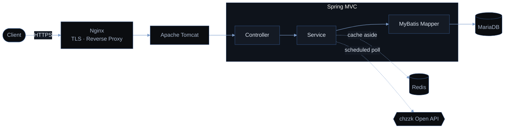
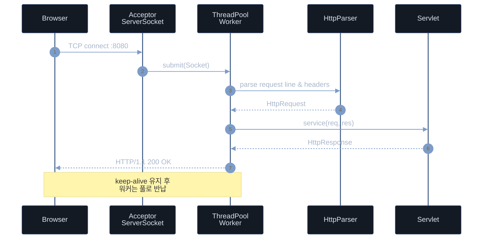

<!--
  ══════════════════════════════════════════════════════════════════════
   S O O I N D E V  ·  GitHub Profile
   Theme    : Slate & Navy — classical engraved plate
   Palette  : #0B0D10  #141A24  #22375C  #7C9CC9  #DBE3EE  #8A93A0
   Assets   : assets/nameplate.svg · assets/rule.svg  (self-hosted, animated)
  ══════════════════════════════════════════════════════════════════════
-->

<div align="center">

<a href="https://github.com/SooinDev">
  
</a>

<br/>


<br/>

<a href="mailto:sooinwithsound@gmail.com"></a>
&nbsp;·&nbsp;
<a href="https://velog.io/@alwayswithsound/posts"></a>
&nbsp;·&nbsp;
<a href="https://alwayswithsound.tistory.com/"></a>
&nbsp;·&nbsp;
<a href="https://solved.ac/alwayswithsound"></a>
&nbsp;·&nbsp;
<a href="https://apps.apple.com/kr/app/codeslice/id6752849706"></a>

<br/><br/>


<table>
<tr><td valign="top">

```java
package dev.sooin;

public final class SooinDev implements Engineer {

    private static final String NAME       = "SooinDev";
    private static final String ROLE       = "Backend Engineer";
    private static final String BASE       = "Incheon, Republic of Korea";
    private static final String EDUCATION  = "Computer Science — Woosong University";
    private static final String PHILOSOPHY = "code with purpose, design with empathy";

    private final List<String> focus = List.of(
        "Microservices Architecture",
        "Performance Optimization",
        "Cloud-Native Development"
    );

    @Override
    public String signature() {
        return "building robust systems — one commit at a time.";
    }
}
```

</td></tr>
</table>

<br/>

<table>
<tr>
<td align="center" width="33%"><br/><b><code>01</code></b><br/><br/><sub><b>서버가 왜 느린지</b><br/>끝까지 파고듭니다</sub><br/><br/></td>
<td align="center" width="33%"><br/><b><code>02</code></b><br/><br/><sub><b>라이브러리보다</b><br/>원리를 먼저 봅니다</sub><br/><br/></td>
<td align="center" width="33%"><br/><b><code>03</code></b><br/><br/><sub><b>만든 것은</b><br/>끝까지 운영합니다</sub><br/><br/></td>
</tr>
</table>

<br/>


<table>
<tr>
  <td align="right" width="120"><sub><b>C O R E</b></sub></td>
  <td>
    
    
    
    
  </td>
</tr>
<tr>
  <td align="right"><sub><b>D A T A</b></sub></td>
  <td>
    
    
    
  </td>
</tr>
<tr>
  <td align="right"><sub><b>C L I E N T</b></sub></td>
  <td>
    
    
    
    
  </td>
</tr>
<tr>
  <td align="right"><sub><b>I N F R A</b></sub></td>
  <td>
    
    
    
    
  </td>
</tr>
</table>

<br/>


<sub>제가 실제로 운영 중인 서비스의 요청 흐름입니다.</sub>

</div>


```mermaid
%%{init: {'theme':'base','themeVariables':{'background':'#0b0d10','primaryColor':'#141a24','primaryTextColor':'#dbe3ee','primaryBorderColor':'#31507f','lineColor':'#7c9cc9','secondaryColor':'#141a24','tertiaryColor':'#0b0d10','clusterBkg':'#0e131b','clusterBorder':'#22375c'}}}%%
flowchart LR
    U(["Client"]) -->|HTTPS| N["Nginx<br/>TLS · Reverse Proxy"]
    N --> T["Apache Tomcat"]

    subgraph APP ["Spring MVC"]
        direction TB
        C["Controller"] --> S["Service"]
        S --> M["MyBatis Mapper"]
    end

    T --> C
    S -.->|cache aside| R[("Redis")]
    M --> D[("MariaDB")]
    S -.->|scheduled poll| X{{"chzzk Open API"}}

    classDef edge fill:#0b0d10,stroke:#31507f,color:#a8b6cc
    class U,N,T,R,D,X edge
```

<div align="center">

<br/>


<table>
<tr>

<td align="center" width="50%" valign="top"><br/>


<br/><br/>

[**`yeti-125.com ↗`**](https://yeti-125.com/) &nbsp;·&nbsp; [**`source →`**](https://github.com/SooinDev/YETI-125)

<br/>

<sub>*Virtual streamer fan archive platform*</sub>

<br/>

<sub>버츄얼 스트리머 이리온의 팬 아카이브 플랫폼입니다.<br/>
chzzk API를 연동해 실시간 방송 상태 · 인기 클립 ·<br/>
다시보기를 자동 수집하고, 방송 일정 캘린더와<br/>
관리자 일정 관리 기능을 Spring MVC로 구현했습니다.<br/>
클라우드 서버에 HTTPS로 배포해 실 운영 중입니다.</sub>

<br/>

`Spring` `MyBatis` `MariaDB` `Tomcat 9`

<br/></td>

<td align="center" width="50%" valign="top"><br/>


<br/><br/>

[**`App Store ↗`**](https://apps.apple.com/kr/app/codeslice/id6752849706) &nbsp;·&nbsp; **`★ 5.0`**

<br/>

<sub>*Smart QR code generator for iOS*</sub>

<br/>

<sub>Wi-Fi 비밀번호 · 연락처 · URL · 텍스트를<br/>
QR 코드로 즉시 변환하는 iOS 앱입니다.<br/>
미니멀한 디자인과 직관적인 UX를 중심으로<br/>
설계했고, App Store에 정식 출시했습니다.</sub>

<br/><br/>

`Flutter` `Dart` `iOS 13.0+`

<br/></td>

</tr>
<tr>

<td align="center" width="50%" valign="top"><br/>


<br/><br/>

[**`source code →`**](https://github.com/SooinDev/AutoFinder)

<br/>

<sub>*AI-powered used car recommendation*</sub>

<br/>

<sub>사용자의 예산 · 용도 · 선호 조건을 분석해<br/>
중고차를 AI로 추천하는 서비스입니다.<br/>
Python 기반 추천 엔진과 Spring 백엔드를 연동하고<br/>
React로 검색 · 가격 분석 · 리뷰 UI를 구현했습니다.</sub>

<br/>

`Spring` `MyBatis` `React` `Python`

<br/></td>

<td align="center" width="50%" valign="top"><br/>


<br/><br/>

[**`source code →`**](https://github.com/SooinDev/jobbridge-backend)

<br/>

<sub>*Smart job matching service with NLP*</sub>

<br/>

<sub>이력서와 채용공고를 NLP로 분석해<br/>
적합도 기반으로 매칭해주는 취업 플랫폼입니다.<br/>
자연어 처리로 직무 키워드를 추출하고<br/>
맞춤 채용 알림 · 통계 대시보드를 제공합니다.</sub>

<br/>

`Spring Boot` `MyBatis` `MySQL` `NLP`

<br/></td>

</tr>
</table>

<br/>


<br/><br/>

[**`source code →`**](https://github.com/SooinDev/tiny-tomcat)

<br/>

<sub>*Tomcat implementation from scratch in pure Java*</sub>

<br/>

<sub>톰캣의 핵심 동작 원리를 순수 Java로 직접 구현한 프로젝트입니다.<br/>
TCP 소켓 통신 · HTTP 파싱 · 서블릿 구조 · 스레드 풀을 외부 라이브러리 없이<br/>
밑바닥부터 구현하며 웹 서버의 내부 동작 원리를 깊이 학습했습니다.</sub>

<br/>

`Java` `Socket` `HTTP` `Thread Pool`

<br/>

</div>

<details>
<summary align="center"><b><code>▾ &nbsp; 요청 하나가 처리되는 과정 &nbsp; ▾</code></b></summary>

<br/>


```mermaid
%%{init: {'theme':'base','themeVariables':{'primaryColor':'#141a24','primaryTextColor':'#dbe3ee','primaryBorderColor':'#31507f','lineColor':'#7c9cc9','secondaryColor':'#0e131b','tertiaryColor':'#0b0d10','signalColor':'#7c9cc9','signalTextColor':'#a8b6cc','actorTextColor':'#dbe3ee','labelBoxBkgColor':'#22375c','labelTextColor':'#dbe3ee'}}}%%
sequenceDiagram
    autonumber
    participant B as Browser
    participant A as Acceptor<br/>ServerSocket
    participant P as ThreadPool<br/>Worker
    participant H as HttpParser
    participant S as Servlet

    B->>A: TCP connect :8080
    A->>P: submit(Socket)
    P->>H: parse request line & headers
    H-->>P: HttpRequest
    P->>S: service(req, res)
    S-->>P: HttpResponse
    P-->>B: HTTP/1.1 200 OK
    Note over P,B: keep-alive 유지 후<br/>워커는 풀로 반납
```

</details>

<div align="center">

<br/>


<br/><br/>


<br/><br/>


<br/><br/>


<br/><br/>


<br/><br/>

[](https://solved.ac/alwayswithsound)

<br/>


<table>
<tr><td>

```
╔══════════════════════════════════════════════════════════════╗
║                                                              ║
║   RUNTIME                                                    ║
║   ├── Framework     Spring Framework · Spring Boot           ║
║   ├── Mapper        MyBatis                                  ║
║   ├── Database      MySQL 8.0 · MariaDB 10.x                 ║
║   ├── Server        Apache Tomcat 8.5.100                    ║
║   └── Language      Java 1.8+ · Dart                         ║
║                                                              ║
║   TOOLCHAIN                                                  ║
║   ├── IDE           IntelliJ IDEA Ultimate · VS Code         ║
║   ├── DB Client     DBeaver Community                        ║
║   ├── VCS           Git · GitHub                             ║
║   └── Terminal      iTerm2                                   ║
║                                                              ║
║   INFRASTRUCTURE                                             ║
║   ├── Cloud         AWS (EC2 · RDS · S3)                     ║
║   ├── OS            Linux (Ubuntu · CentOS) · macOS          ║
║   └── CI/CD         GitHub Actions                           ║
║                                                              ║
║   MOBILE                                                     ║
║   ├── Framework     Flutter (Cross-Platform)                 ║
║   └── Distribution  App Store                                ║
║                                                              ║
╚══════════════════════════════════════════════════════════════╝
```

</td></tr>
</table>

<br/>


<details>
<summary><b><code>▾ &nbsp; 코딩 시간 리포트 펼쳐보기 &nbsp; ▾</code></b></summary>

<br/>

<!--START_SECTION:waka-->


**🐱 My GitHub Data** 

> 📦 219.9 kB Used in GitHub's Storage 
 > 
> 🏆 177 Contributions in the Year 2026
 > 
> 🚫 Not Opted to Hire
 > 
> 📜 15 Public Repositories 
 > 
> 🔑 23 Private Repositories 
 > 
**I'm a Night 🦉** 

```text
🌞 Morning                278 commits         █████████░░░░░░░░░░░░░░░░   34.97 % 
🌆 Daytime                76 commits          ██░░░░░░░░░░░░░░░░░░░░░░░   09.56 % 
🌃 Evening                324 commits         ██████████░░░░░░░░░░░░░░░   40.75 % 
🌙 Night                  117 commits         ████░░░░░░░░░░░░░░░░░░░░░   14.72 % 
```
📅 **I'm Most Productive on Thursday** 

```text
Monday                   130 commits         ████░░░░░░░░░░░░░░░░░░░░░   16.35 % 
Tuesday                  87 commits          ███░░░░░░░░░░░░░░░░░░░░░░   10.94 % 
Wednesday                70 commits          ██░░░░░░░░░░░░░░░░░░░░░░░   08.81 % 
Thursday                 284 commits         █████████░░░░░░░░░░░░░░░░   35.72 % 
Friday                   58 commits          ██░░░░░░░░░░░░░░░░░░░░░░░   07.30 % 
Saturday                 66 commits          ██░░░░░░░░░░░░░░░░░░░░░░░   08.30 % 
Sunday                   100 commits         ███░░░░░░░░░░░░░░░░░░░░░░   12.58 % 
```


📊 **This Week I Spent My Time On** 

```text
🕑︎ Time Zone: Asia/Seoul

💬 Programming Languages: 
Java                     9 hrs 38 mins       █████████████████░░░░░░░░   66.19 % 
TypeScript               2 hrs 3 mins        ████░░░░░░░░░░░░░░░░░░░░░   14.13 % 
Markdown                 1 hr 41 mins        ███░░░░░░░░░░░░░░░░░░░░░░   11.61 % 
JavaScript               42 mins             █░░░░░░░░░░░░░░░░░░░░░░░░   04.84 % 
Other                    19 mins             █░░░░░░░░░░░░░░░░░░░░░░░░   02.26 % 

🔥 Editors: 
Claude Code              7 hrs 58 mins       ██████████████░░░░░░░░░░░   54.79 % 
IntelliJ IDEA            6 hrs 35 mins       ███████████░░░░░░░░░░░░░░   45.21 % 

🐱‍💻 Projects: 
odolog                   6 hrs               ██████████░░░░░░░░░░░░░░░   41.23 % 
YETI-125                 5 hrs 22 mins       █████████░░░░░░░░░░░░░░░░   36.95 % 
Cartree                  2 hrs 57 mins       █████░░░░░░░░░░░░░░░░░░░░   20.33 % 
scratch-2026-09-05-fb208512 mins             ░░░░░░░░░░░░░░░░░░░░░░░░░   01.41 % 
T                        0 secs              ░░░░░░░░░░░░░░░░░░░░░░░░░   00.07 % 

💻 Operating System: 
Mac                      14 hrs 33 mins      █████████████████████████   100.00 % 
```

🤖 **AI Coding This Week** 

```text
⏱ AI Coding Time: 11 hrs 17 mins (77.57%)

✍️ 2,311 lines written by AI, 165 lines written by hand (93.34% AI-written)

🔤 3,367,324 Input Tokens, 974,212 Output Tokens

💵 $121.46 Estimated AI Cost This Week

🧠 15 AI Sessions, 152 AI Prompts

Sonnet                   2,418 lines         █████████████████████████   99.34 % 
Opus                     16 lines            ░░░░░░░░░░░░░░░░░░░░░░░░░   00.66 % 

🔎 AI Coding Insights:
🤖 AI-Driven — 93.34% of written lines came from AI
📝 Concise Prompter — average 386 characters per prompt
🔁 Iterative Prompter — average 10 prompts per session
🚀 High AI Trust — 8.32% of changed lines were hand-edited
```

**I Mostly Code in Java** 

```text
Java                     19 repos            ████████████░░░░░░░░░░░░░   47.50 % 
Dart                     7 repos             ████░░░░░░░░░░░░░░░░░░░░░   17.50 % 
Swift                    3 repos             ██░░░░░░░░░░░░░░░░░░░░░░░   07.50 % 
HTML                     3 repos             ██░░░░░░░░░░░░░░░░░░░░░░░   07.50 % 
TypeScript               2 repos             █░░░░░░░░░░░░░░░░░░░░░░░░   05.00 % 
```


**Timeline**


 Last Updated on 12/09/2026 02:05:00 UTC
<!--END_SECTION:waka-->

</details>

<br/><br/>


<br/>


&nbsp;

&nbsp;


<br/><br/>


<br/>


&nbsp;

&nbsp;
<a href="mailto:sooinwithsound@gmail.com"></a>

<br/><br/>


</div>
