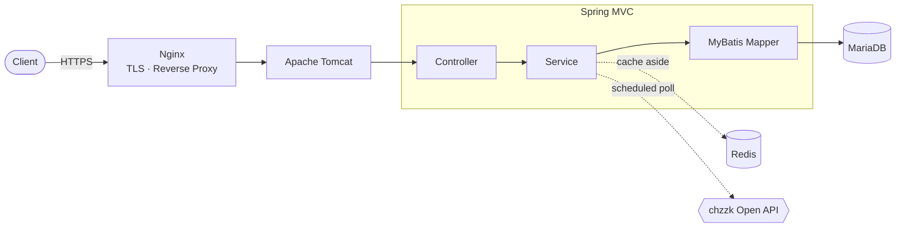

# Sooin · Backend Engineer

Java와 Spring으로 서버를 만들고, 만든 서비스는 배포 이후까지 직접 운영합니다.

---

인천 · 우송대학교 컴퓨터공학

[Velog](https://velog.io/@alwayswithsound/posts) · [Tistory](https://alwayswithsound.tistory.com/) · [solved.ac](https://solved.ac/alwayswithsound) · [App Store](https://apps.apple.com/kr/app/codeslice/id6752849706) · [sooinwithsound@gmail.com](mailto:sooinwithsound@gmail.com)

---

## About

서버가 느려지면 원인을 찾을 때까지 쿼리 로그와 프로파일링을 뒤집니다. 라이브러리를 고르기 전에 그 안에서 무슨 일이 일어나는지 먼저 확인하는 편이고, 톰캣이 궁금해서 소켓 통신부터 스레드 풀까지 순수 Java로 직접 구현해 본 적이 있습니다.

만든 것은 배포로 끝내지 않습니다. 팬 아카이브 서비스 한 개를 클라우드에서 실운영 중이고, iOS 앱 한 개를 App Store에 출시해 관리하고 있습니다.

관심 분야는 마이크로서비스 아키텍처, 성능 최적화, 클라우드 네이티브 개발입니다.

## Tech

| | |
| --- | --- |
| **Language** | Java 8+, Dart, JavaScript, Python |
| **Backend** | Spring Framework, Spring Boot, MyBatis |
| **Database** | MySQL 8.0, MariaDB 10.x, Redis |
| **Client** | Flutter, React |
| **Infra** | AWS (EC2 · RDS · S3), Nginx, Apache Tomcat, Linux, GitHub Actions |
| **Tools** | IntelliJ IDEA, VS Code, DBeaver, Git, iTerm2 |

## Projects

| 프로젝트 | 설명 | 스택 |
| --- | --- | --- |
| **[YETI-125](https://github.com/SooinDev/YETI-125)** [yeti-125.com](https://yeti-125.com/) | 버츄얼 스트리머 팬 아카이브 플랫폼. chzzk Open API를 연동해 실시간 방송 상태와 인기 클립, 다시보기를 주기적으로 수집하고 방송 일정 캘린더와 관리자 기능을 붙였습니다. 클라우드 서버에 HTTPS로 배포해 운영 중입니다. | Spring · MyBatis · MariaDB · Tomcat 9 |
| **[CodeSlice](https://apps.apple.com/kr/app/codeslice/id6752849706)** | Wi-Fi 비밀번호, 연락처, URL, 텍스트를 QR 코드로 바로 바꿔주는 iOS 앱. 화면을 최소한으로 줄이는 데 집중했고 App Store에 정식 출시했습니다. | Flutter · Dart · iOS 13.0+ |
| **[AutoFinder](https://github.com/SooinDev/AutoFinder)** | 예산과 용도, 선호 조건을 입력받아 중고차를 추천하는 서비스. Python 추천 엔진을 Spring 백엔드와 연동하고 검색·가격 분석·리뷰 화면을 React로 구현했습니다. | Spring · MyBatis · React · Python |
| **[JobBridge](https://github.com/SooinDev/jobbridge-backend)** | 이력서와 채용공고에서 NLP로 직무 키워드를 추출해 적합도 기준으로 매칭하는 취업 플랫폼. 맞춤 채용 알림과 통계 대시보드를 제공합니다. | Spring Boot · MyBatis · MySQL · NLP |
| **[tiny-tomcat](https://github.com/SooinDev/tiny-tomcat)** | 톰캣의 핵심 동작 원리를 외부 라이브러리 없이 순수 Java로 구현한 학습용 프로젝트. TCP 소켓 통신, HTTP 파싱, 서블릿 구조, 스레드 풀을 밑바닥부터 만들었습니다. | Java · Socket · HTTP · Thread Pool |

## Architecture

실제로 운영 중인 YETI-125의 요청 흐름입니다.

```mermaid
flowchart LR
    U([Client]) -->|HTTPS| N[Nginx<br/>TLS · Reverse Proxy]
    N --> T[Apache Tomcat]

    subgraph APP [Spring MVC]
        direction TB
        C[Controller] --> S[Service]
        S --> M[MyBatis Mapper]
    end

    T --> C
    S -. cache aside .-> R[(Redis)]
    M --> D[(MariaDB)]
    S -. scheduled poll .-> X{{chzzk Open API}}
```

## Activity

코딩 시간 리포트

<!--START_SECTION:waka-->
<!--END_SECTION:waka-->

---

백엔드 포지션과 사이드 프로젝트 협업 모두 열려 있습니다. [sooinwithsound@gmail.com](mailto:sooinwithsound@gmail.com)
